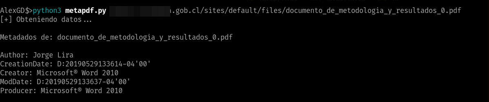

# METAPDF

Obtén metadatos de archivos PDF sin descargarlo en tu ordenador todo en memoria.


**Dependencias necesarias:**

```bash
pip install PyPDF2
```


**USO:**

```bash
metapdf.py https://site.com/files/file.pdf
```

**Preview:**




**Google DORK para la obtención de archivos PDFs de sitios gob.*:**

```bash
ext:pdf site:gob.*
```


**Feliz Hacking!!!**
